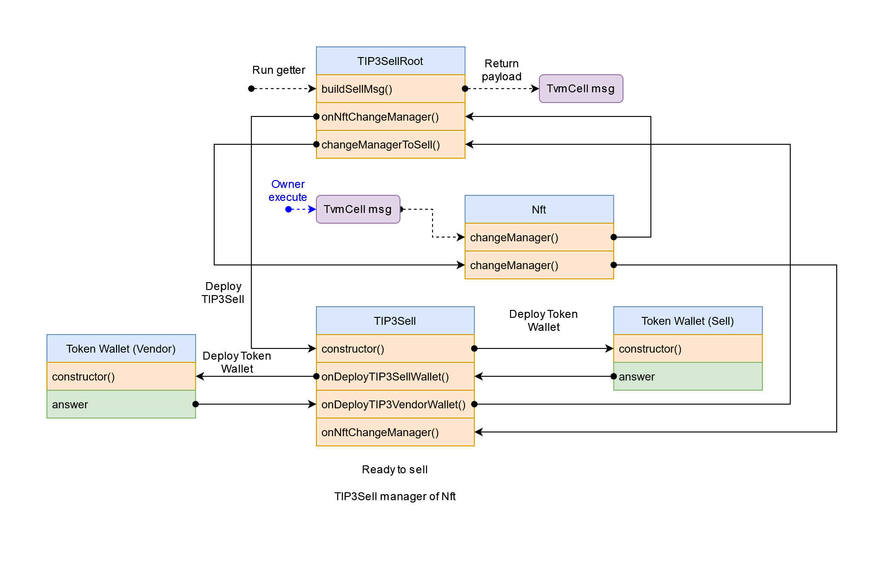
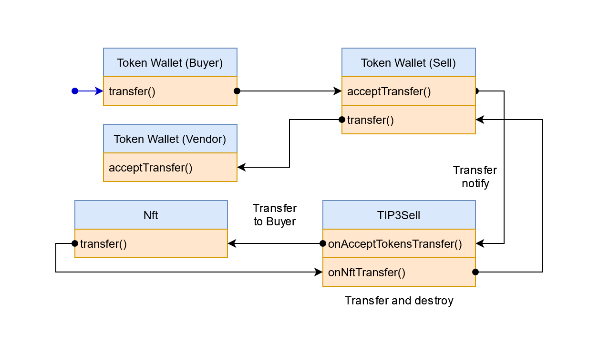

# <center>Finance</center>
#### <center>TIP3 Secondary Market For StandardWebToken Sample</center>


### <center>How it work</center>
##### <center>Sell</center>

##### <center>Buy</center>

---
### <center>How to build</center>
* Setup your `locklift.config.ts`
* NPM:
    ```bash
    npm install
    ```
* Build:
    ```bash
    npx locklift build
    ```
---
### <center>Run local tests</center>
* Run:
    ```bash
    npm run test
    ```
    Success output:
    ```text
    TIP3Sell Test
    Deploy Contracts
      Users
    - Account address (Base Owner): 0:71a274f2f12ec66697e2bf7027bb402ac8bf169bf7455c110205a866fa1f7ce6
    - Account address (Vendor): 0:1d6819e2f82ce34bd13ccd136ca97ab68964fcab7e0b275077513e6e54b6a17d
    - Account address (Buyer): 0:a83e1a87dc5fe04b024127c5bcf4da57956bfe8579c00b6b4cbe8331662e6a0d
        ✔ Deploy Users Accounts (5313ms)
      Collection
    - Collection address: 0:b896ad668b240c7613cf4ddb9112846220ef39fdab421ea9b2d5f4ada7c967a4
        ✔ Deploy collection (2039ms)
    - NFT address: 0:b3f3da629f494df3229a1a679d91dc7a9a76f0a8ae61452ce662d02ddcee56f7
    - NFT address: 0:db4d5eea5a7c70c905ad406224d58b9cbb0c70eeb5412e149aa779577fbeb1ec
        ✔ Mint NFT for Vendor (2583ms)
      TIP3 Token Root
    - Token root address: 0:268dbc187bf2c9197f23514b4c10339cd3145c94a8fc87d0bef8e6752cb66a4a
        ✔ Deploy TIP3 Token Root (1486ms)
    - User token wallet: 0:423c1a749f111327022c70c3d332cc29bfb92bac9d3eae8e170d231c949bda20
    - Mint 1000 TOKENS to Buyer
        ✔ Mint tokens to Buyer (1006ms)
      TIP3 Sell Root
    - TIP3SellRoot address: 0:9f842b98850c7b318c73931effd2fce2130cc135c0463c689d5377ba40848569
        ✔ Deploy TIP3SellRoot (2033ms)
    Create sell offers
    - Create offer: 0:d5208499216deb6af5598848dceb11a78163aaabc3f97501cfe940c920d46fb4
    Change manager for NFT_1 to => 0:d5208499216deb6af5598848dceb11a78163aaabc3f97501cfe940c920d46fb4
    - Create offer: 0:7fd006f195533f151f91d187ce244c2280312f980dbe996ce1f3b9fe25e2d20f
    Change manager for NFT_2 to => 0:7fd006f195533f151f91d187ce244c2280312f980dbe996ce1f3b9fe25e2d20f
      ✔ Sell NFTs (2537ms)
      ✔ Check sell offers (102ms)
    Confirm offer
    - Confirm offer by: 0:a83e1a87dc5fe04b024127c5bcf4da57956bfe8579c00b6b4cbe8331662e6a0d
    Change owner for NFT_1 to => 0:a83e1a87dc5fe04b024127c5bcf4da57956bfe8579c00b6b4cbe8331662e6a0d
    Vendor Token Wallet: 100 TOKENS
    Buyer Token Wallet: 900 TOKENS
      ✔ Buy (1974ms)
    Cancel offer
    - Cancel offer by owner: 0:1d6819e2f82ce34bd13ccd136ca97ab68964fcab7e0b275077513e6e54b6a17d
    Change owner for NFT_2 to => 0:1d6819e2f82ce34bd13ccd136ca97ab68964fcab7e0b275077513e6e54b6a17d
      ✔ Cancel (1506ms)
    ```
---
### <center>Deploy</center>

##### <center>Wallet</center>
* Deploy:
    ```bash
    npm run deploy_wallet
    ```
    Success output:
    ```text
    ✔ Wallet deployed at: 0:d1eb2c6f4efa074dc5d514ad6661cd54d6ad379e87ca6b109a9a3b46c4d562eb (Balance: 9.982396999)
    ```

##### <center>Collection (StandardWebToken)</center>
* Deploy:
    ```bash
    npm run deploy_collection
    ```
    Success output:
    ```text
    ✔ Collection deployed at: 0:581bac3339b3d25fe323c22614c57537588ef6153236263484fae89fc07ab4c0 (Balance: 1.742231999)
    ```

##### <center>TIP3 Token Root</center>
* Deploy:
    ```bash
    npm run deploy_tip3_root
    ```
    Success output:
    ```text
    ✔ Initial supply to … 0:f725d4b5dc7c201c6df460e239f578d463f3a422b6b08b465dc4bed9df4a2e6c
    ✔ Initial supply value … 1000
    ✔ TokenRoot deployed at: 0:becc13453057e5391771cf2d39ade2a26afe2b722909906add6ad0940cdd85ab (Balance: 1)
    ```

##### <center>Sell Root</center>
* Deploy:
    ```bash
    npm run deploy_sell_root
    ```
    Success output:
    ```text
    ✔ TokenRoot … 0:becc13453057e5391771cf2d39ade2a26afe2b722909906add6ad0940cdd85ab
    ✔ TIP3SellRoot deployed at: 0:efe63a601ec5855fede798e9d64bea7c5d46ad0f73d22cf69a60a81cf6fa0104 (Balance: 1.928760999)
    ```
